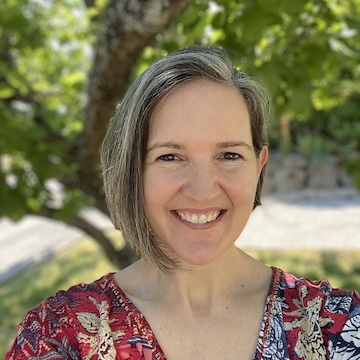

{: .mx-auto.d-block :}

I'm Katherine Davis, a statistical consultant with a PhD and over 10 years of experience in market research, analytics, and biostatistics. I founded Sound Statistics in response to a demonstrated need in my community of academic researchers and industry practitioners for study design, statistical methods, and program evaluation support.

Education

  University of Washington Department of Biostatistics, PhD 2010  
  University of Washington Department of Biostatistics, MS 2006  
  Clemson University Department of Mathematics, BS 1998  

Experience

  Principal Biostatistician, Cystic Fibrosis TDN Coordinating Center, Seattle Children's 2017-2025  
  Senior Biostatistican and Associate Director (Analytics), Surgical Outcomes Research Center, University of Washington 2016-2017  
  Biostatistician, Bloodworks Northwest Research Institute 2015-2016  
  Biostatistics Consultant, Center for Biomedical Statistics, University of Washington 2013-2015  
  Postdoctoral Fellow, Fred Hutchinson Cancer Research Center 2010-2013  

[Learn about my services and submit a request](./services.md) to schedule a complementary initial consultation.
